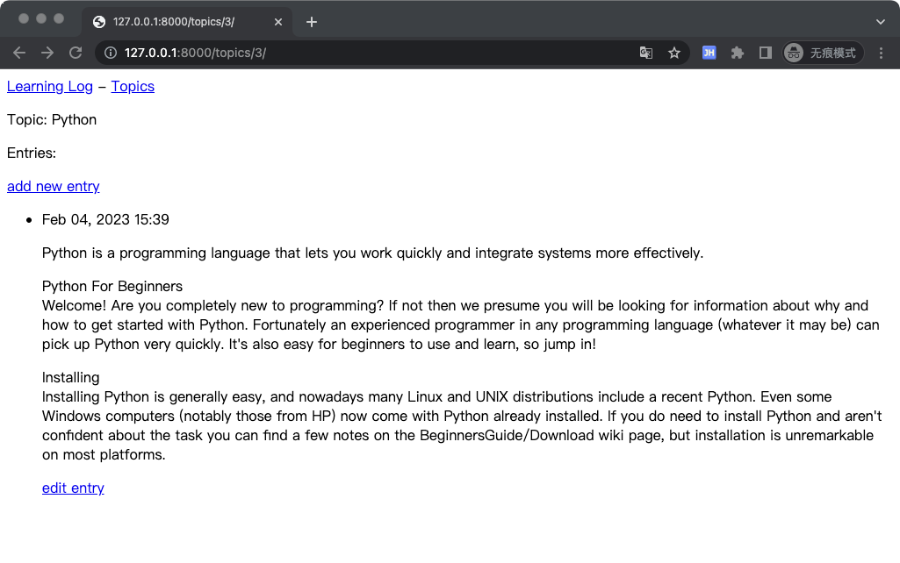
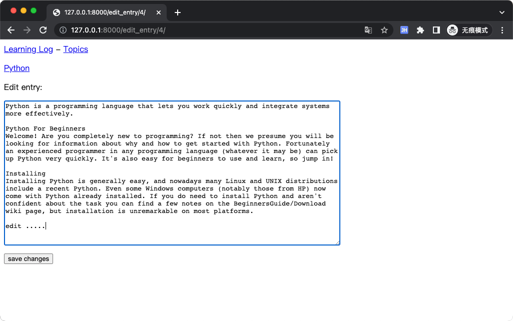
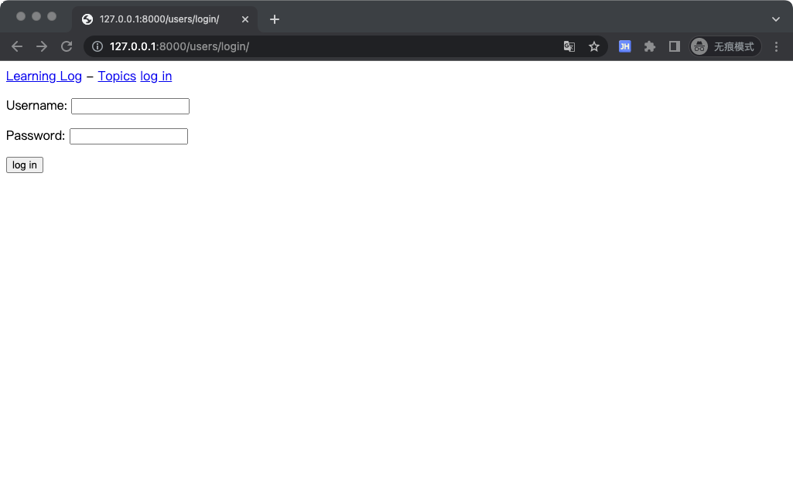
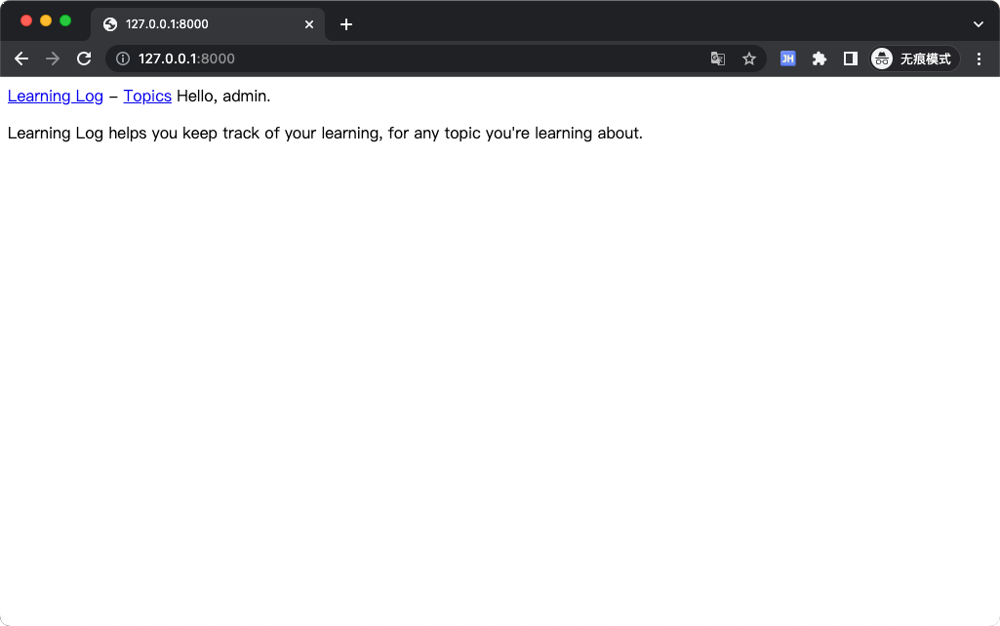
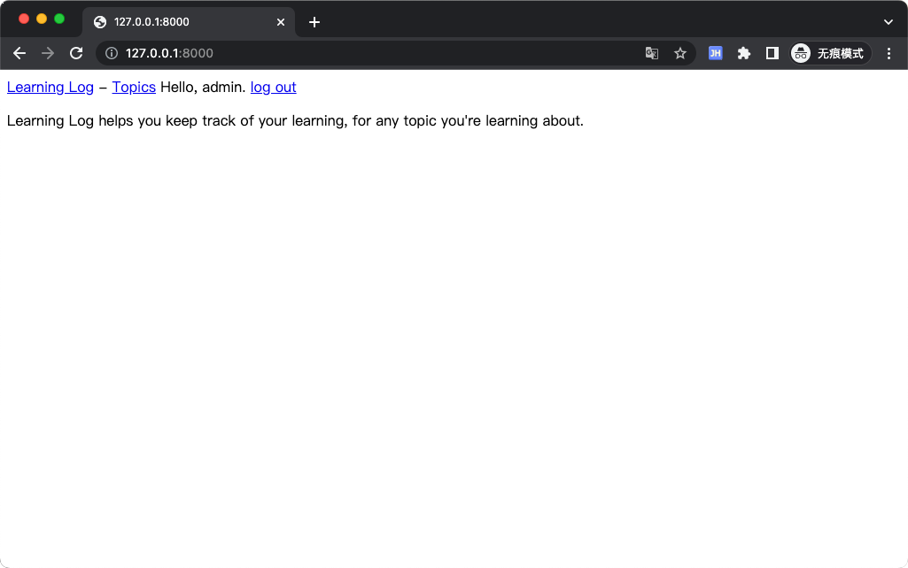
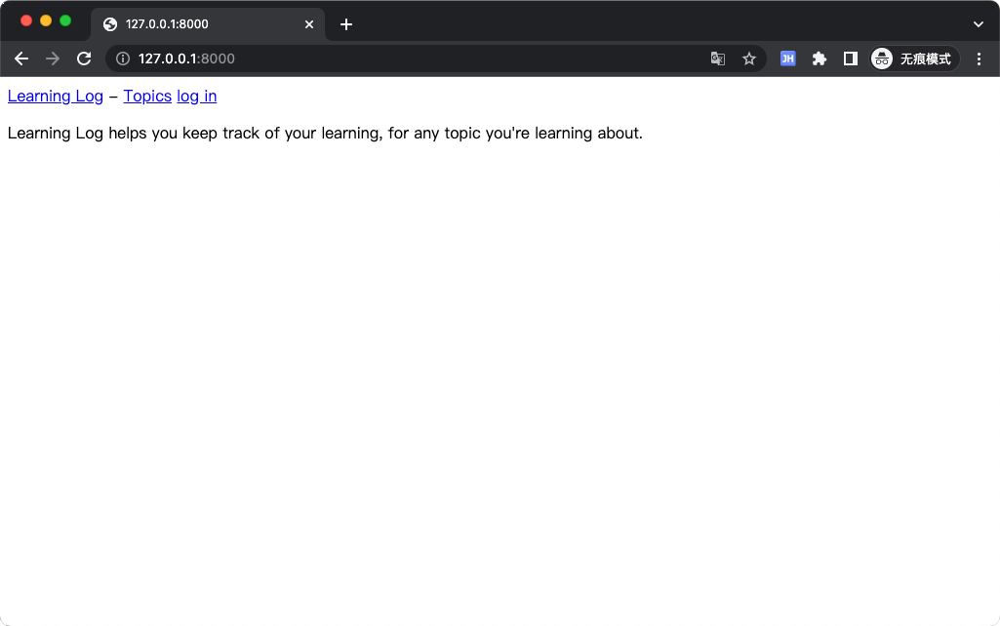
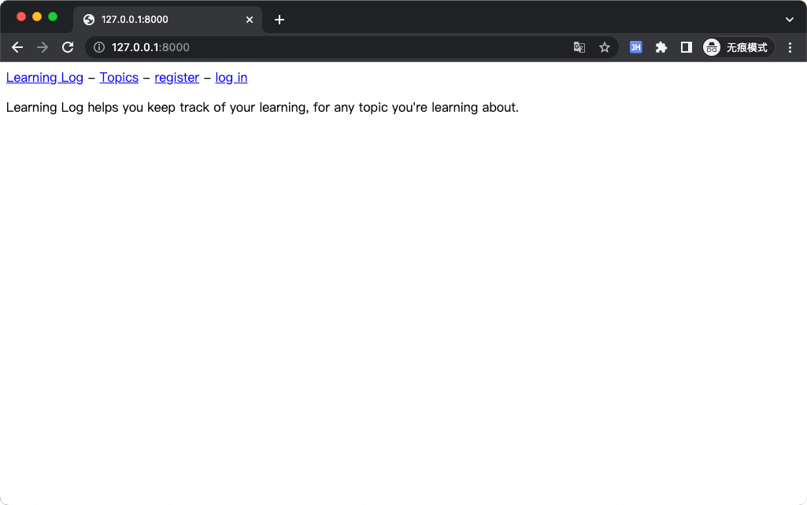
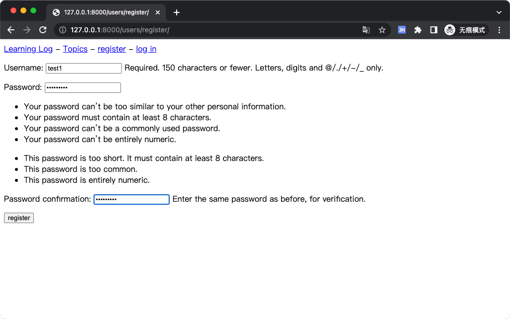
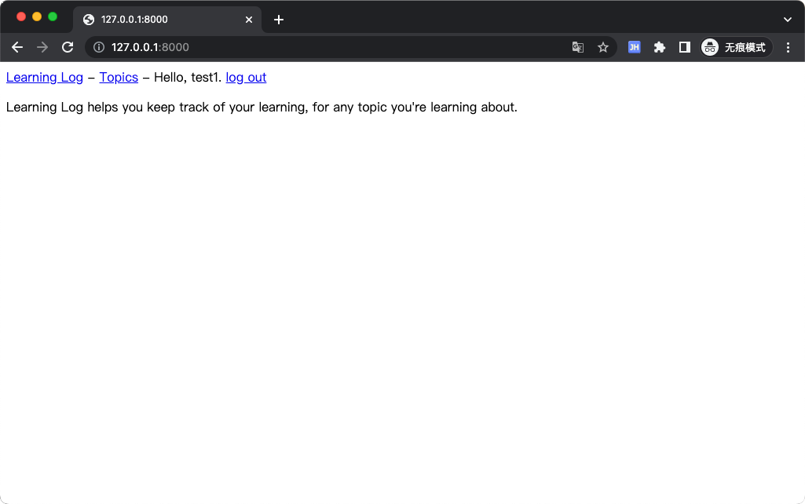

# Learning Log，学习笔记
学习笔记，实现让用户能够记录感兴趣的主题，并在学习每个主题的过程中添加日志条目。

# ENV
- Python 3.9.1
- Django 4.0.1
- PyCharm 2022.2.2

# Running
```shell
# install
$ pip3 install -r requirements.txt

# running
$ python manage.py runserver 0.0.0.0:8000

# Login
## admin/123456
## test1/Ab@123456
```

# Screenshot
## Index


## Topics


## Topic


## New topic
<div align="center">
   
   
</div>
<div align="center">
   
   
</div>

## New entry  

<div align="center">
   
   
</div>

## Edit entry
<div align="center">
   
   
</div>

## User login
<div align="center">
   
   
</div>

## User logout
<div align="center">
   
   
</div>

## User register

<div align="center">
   
   
</div>
