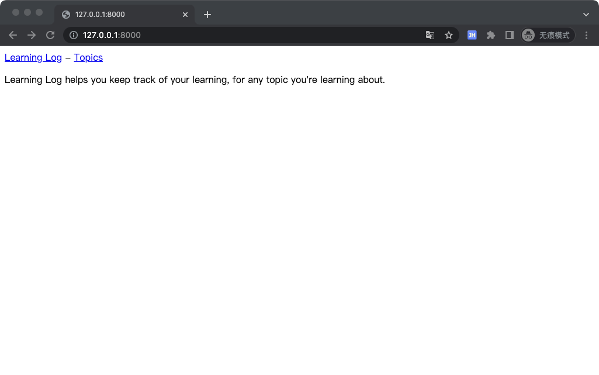
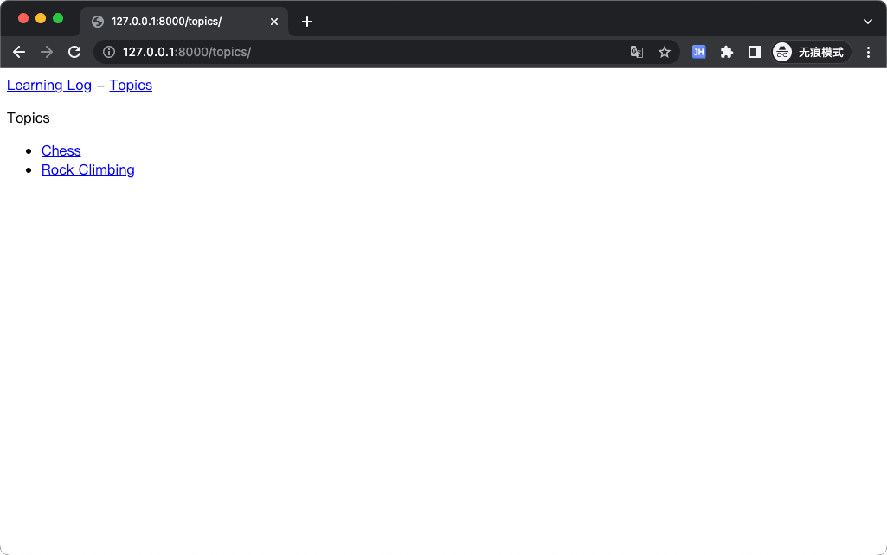
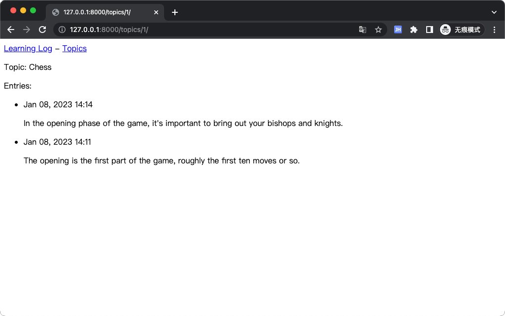
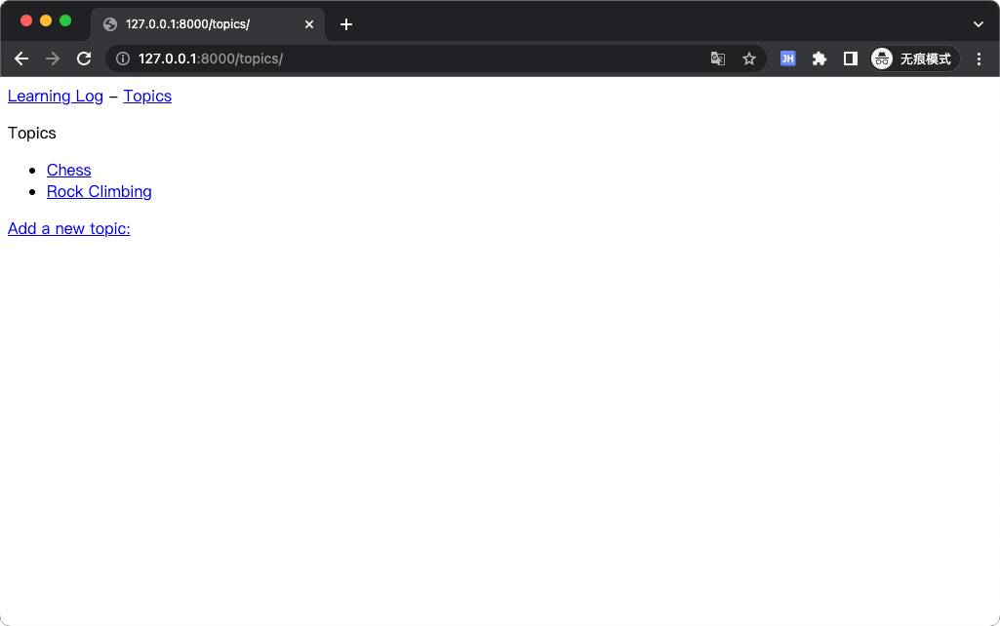
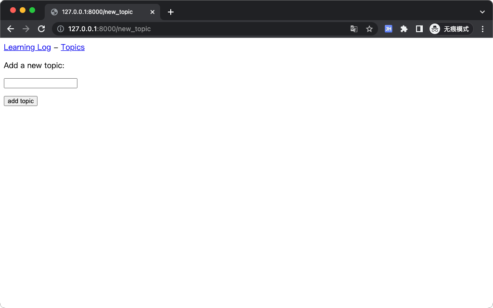
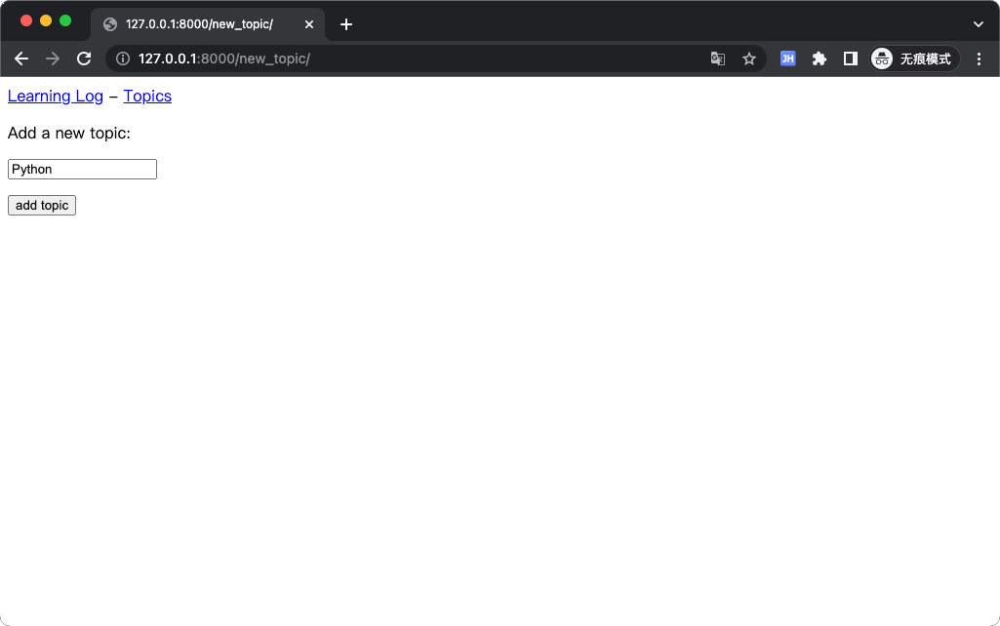
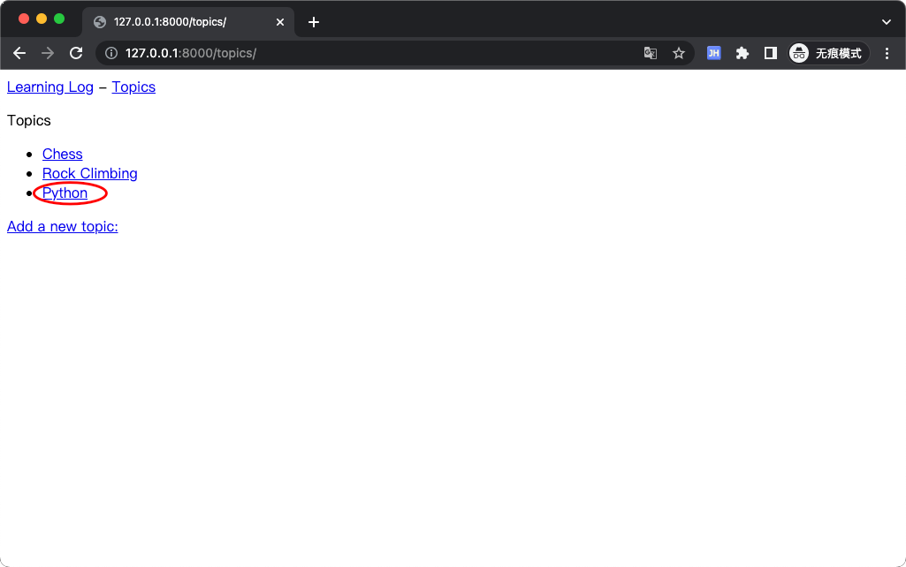
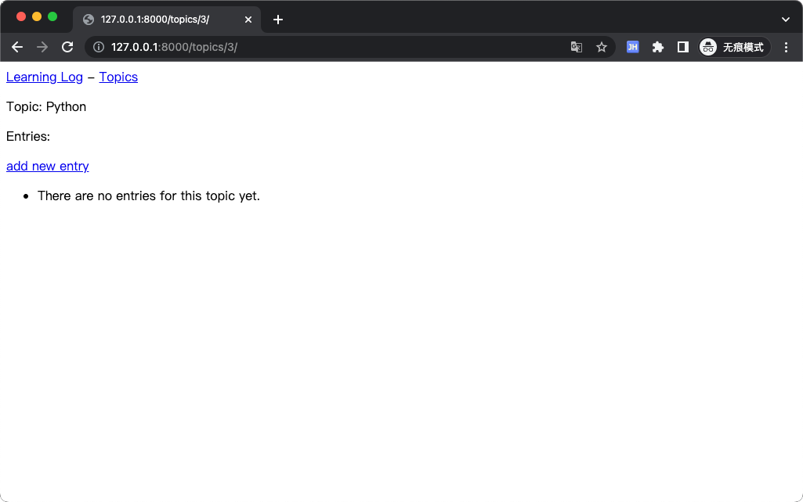
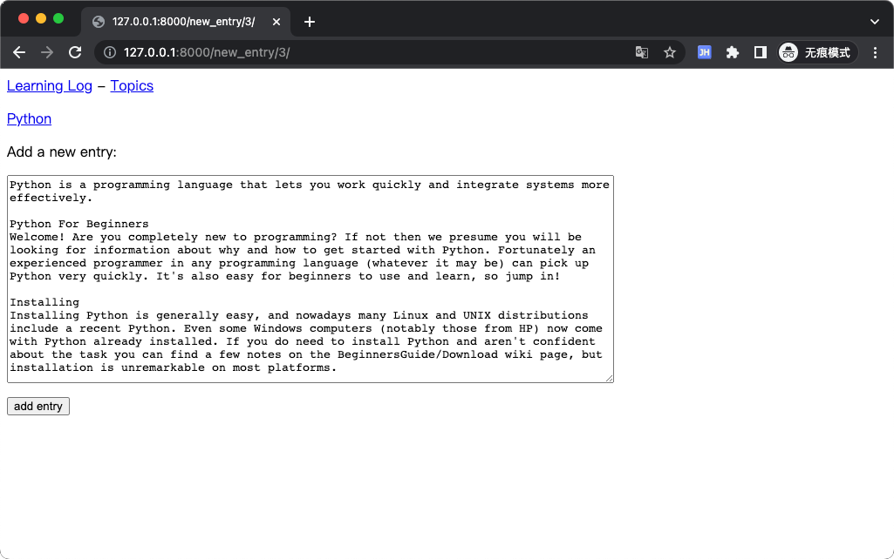
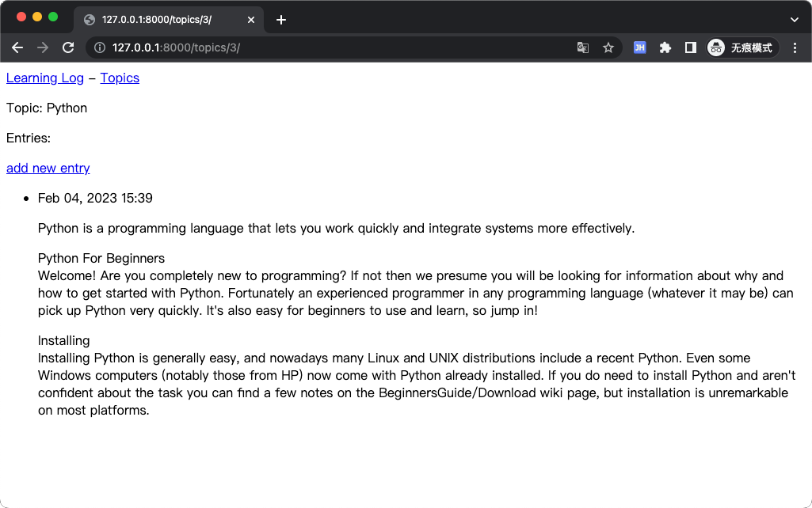

# Learning Log，学习笔记
学习笔记，实现让用户能够记录感兴趣的主题，并在学习每个主题的过程中添加日志条目。

# ENV
- Python 3.9.1
- Django 4.0.1
- PyCharm 2022.2.2

# Screenshot
## Index

## Topics

## Topic

## New topic

## New entry

